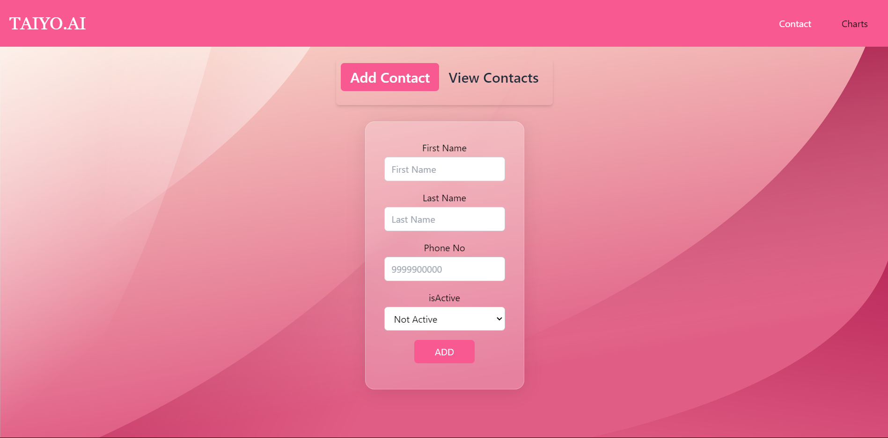
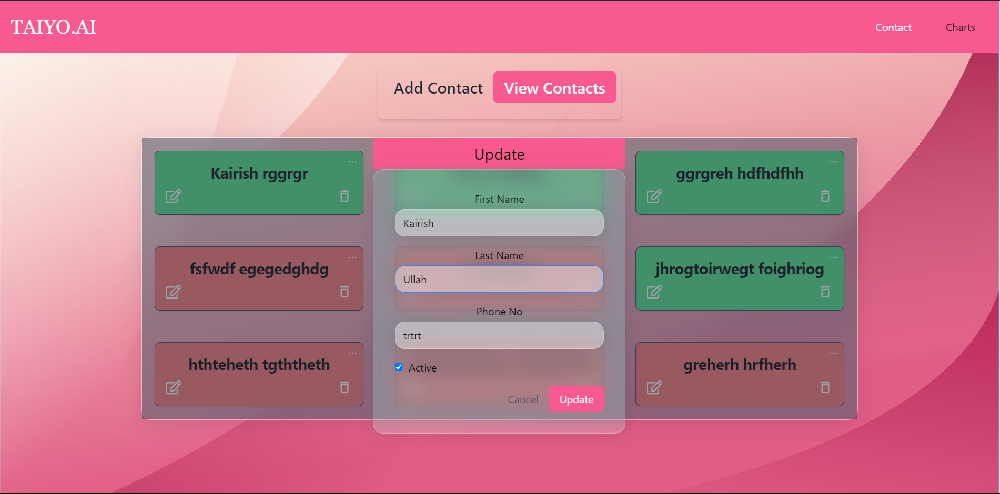
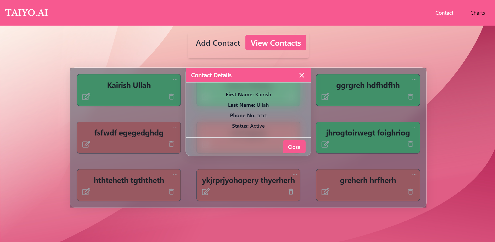
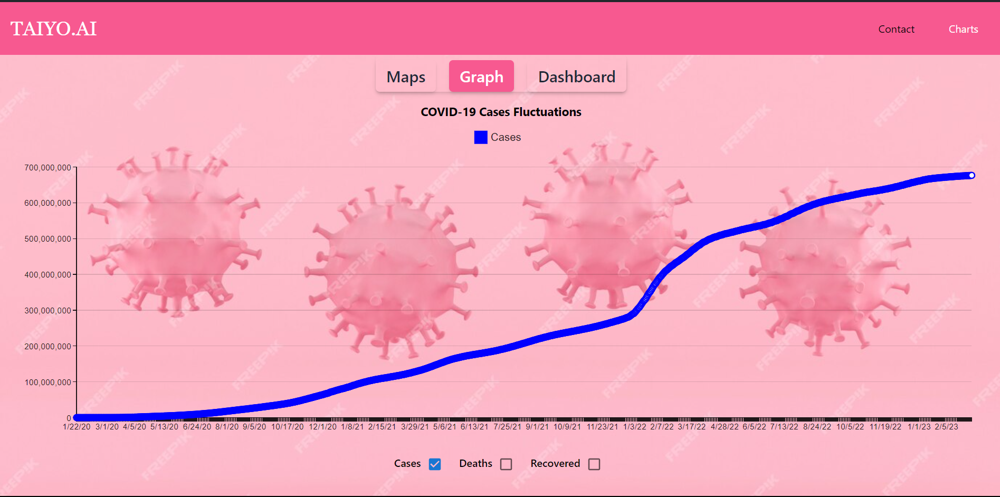
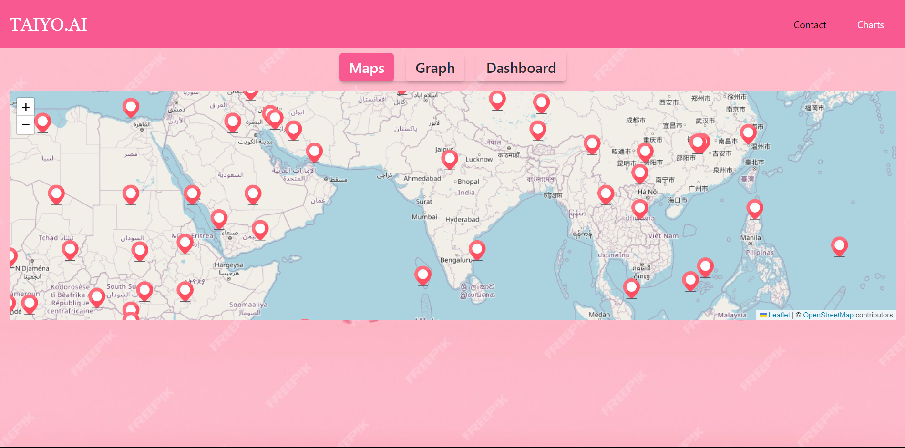
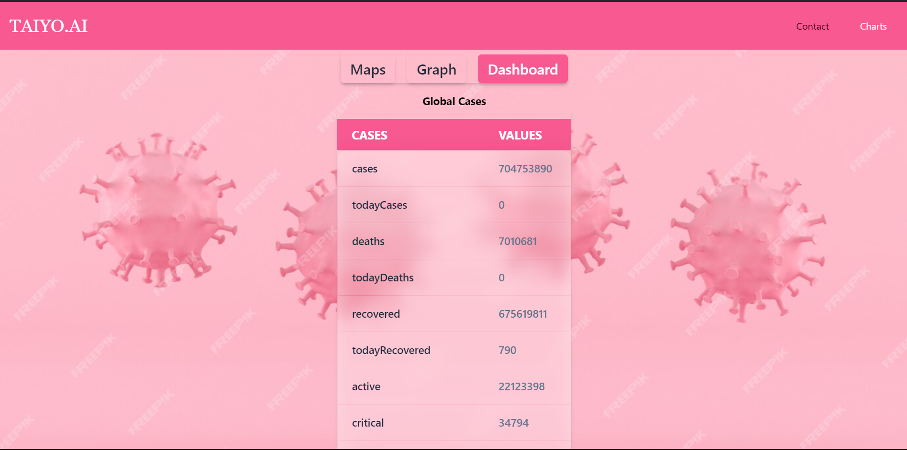

# Contacts Management and Covid Cases Tracker

## Live Site Here: [Visit Here](https://contact-maps-taiyo.netlify.app/)

The aim of this project is to let users manage their contats and to provide details to the user about the covid cases around the world using different ways like charts,maps and a dashboard.

## Technologies Used

In this project, we utilized the following technologies:

- **React.js**: A JavaScript library for building user interfaces.

  - [React.js Official Website](https://reactjs.org/)

- **Tailwind CSS**: A utility-first CSS framework for rapidly building custom designs.

  - [Tailwind CSS Official Website](https://tailwindcss.com/)

- **TypeScript**: A strongly-typed superset of JavaScript that compiles to plain JavaScript.

  - [TypeScript Official Website](https://www.typescriptlang.org/)

- **Redux**: A predictable state container for JavaScript apps.

  - [Redux Official Website](https://redux.js.org/)

- **React Query**: A data-fetching library for React.

  - [React Query Official GitHub](https://github.com/tannerlinsley/react-query)

- **React Router**: A collection of navigational components for React applications.
  - [React Router Official Website](https://reactrouter.com/)

## Getting Started

This is an example of how to get the copy projec locally on the desktop.

## Prerequisites

Nodejs should be installed

## Installation

First Clone the Project

### `git clone https://github.com/Wasif0787/TAIYO.AI.git`

Move to the root directory of the project.

### `cd TAIYO.AI`

Now install all dependencies.

### `npm install`

Now start the project using:

### `npm start`

Visit [http:localhost:3000](http://localhost:3000) to view the project running

# Project Overview

This section provides an overview of the project structure and key features.

## Contact Section

### Add Contact Tab

- Description: Allows users to add new contacts.
- Functionality:
  - Users can input contact details.
  - Contacts are stored using Redux and localStorage.

### View Contacts Tab

- Description: Displays all contacts.
- Functionality:

  - Users can view a list of all saved contacts.
  - Each contact includes options to update, delete, and view details of that contact.
    -Green background indicates contact is active whereas red background indicates contact is inactive.

- View Contacts
  

- Update Contacts
  

- Details of the Contacts
  

## Charts Section

### Graphs

- Description: Displays COVID-19 data in graph format.
- Data Source: https://disease.sh/v3/covid-19/historical/all?lastdays=all
- Data Overview: This API fetched data of Covid cases having three section Cases,Deaths and Recovered.
- Functionality:
  - Fetches data from the provided API endpoint.
  - Displays graphs showing COVID-19 cases, deaths, and recoveries over time.
  - X-axis shows dates while Y-axis hows numbers.

## Maps Section

### COVID-19 Maps

- Description: Displays COVID-19 data on an interactive map.
- Data Source: https://disease.sh/v3/covid-19/countries
- Data Overview: This API fetched data from the provided API endpoint with all countries data including latitude , longitude, totlaCases, deaths, recovered.
- Functionality:
  - Fetches data from the provided API endpoint.
  - Places markers on the map to represent COVID-19 data for each country.
  - Includes tooltips with details such as country name, active cases, recoveries, and deaths.

## Dashboard Section

### Global Cases Overview

- **Description:** Provides an overview of global COVID-19 cases.
- **Data Source:** https://disease.sh/v3/covid-19/all
- **Data Overview:** This API fetches global COVID-19 data, including total cases, deaths, recoveries, active cases, critical cases, and more.
- **Functionality:**
  - Fetches data from the provided API endpoint.
  - Displays the fetched data in a tabular format.
  - Excludes the "updated" key from the displayed data.
  - Updates the UI with loading animations while fetching and processing data.

